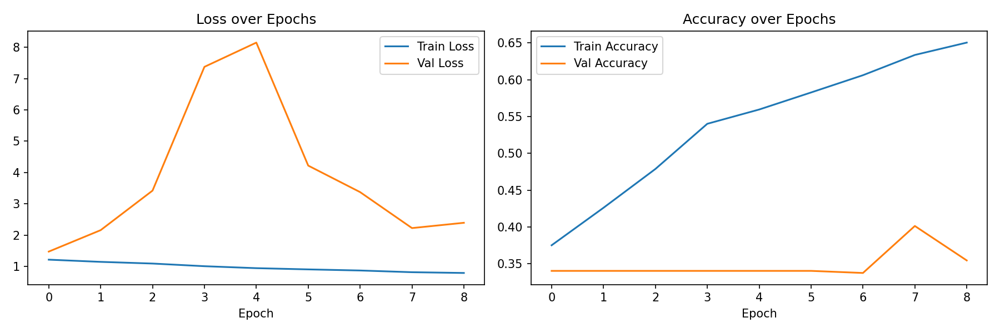
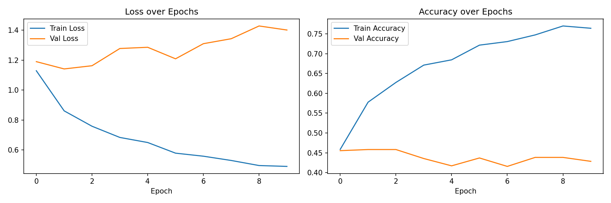
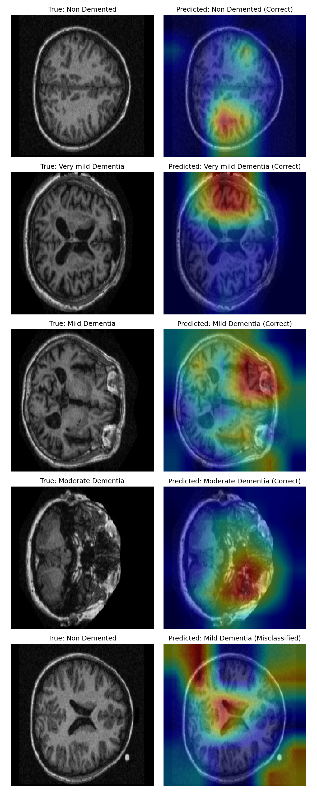

# Trustworthy NeuroAI: Explainable Deep Learning for Alzheimer's MRI Classification

*An explainable AI system for classifying Alzheimer's disease severity from brain MRI, with biological validation of model attention against known neuroanatomical biomarkers.*

## Motivation

I'm a Baylor University graduate with a Bachelor's of Science in Neuroscience, and I've worked at a nursing home as a dietary assistant since 2022. Being surrounded daily by elderly residents with varying levels of cognitive ability — some struggling to remember their surroundings, the staff around them, or even their own meal orders — inspired me to build a project that goes beyond prediction accuracy. I wanted an AI system whose reasoning could actually be trusted by clinicians, researchers, and physicians, not one that simply claims its answer is correct. This is part of why this project treats Grad-CAM validation, not just accuracy, as a core deliverable.

There are many brain MRI classification projects online. This project is deliberately different: rather than optimizing purely for accuracy, it treats **explainability, honest evaluation, and biological plausibility** as the primary contribution — the kind of rigor expected from an ML engineer working in healthcare AI, not a classroom exercise.

## Live Demo

Try the deployed application: **[Trustworthy NeuroAI on Streamlit](https://neuroai-alzheimers-classification-kz3qwqbknfvwgwqgm76bcw.streamlit.app)**

Upload a brain MRI slice to see the model's prediction, confidence breakdown, Grad-CAM visualization, and an optional plain-language explanation (powered by a constrained LLM layer — see Deployment section below). Confirmed test-set sample images are available in [`app/sample_images/`](app/sample_images/) if you don't have a scan handy.

## Dataset

- **Source:** [OASIS Alzheimer's Detection dataset](https://www.kaggle.com/datasets/ninadaithal/imagesoasis) (Kaggle), derived from OASIS-1, ~86,000 MRI slices across 461 patients, 4 classes (Non-Demented, Very Mild, Mild, Moderate Dementia)
- **Subsampling:** A patient-level, stratified subsample (~5,000 images) was used rather than the full dataset, to fit compute constraints while preserving the dataset's authentic class imbalance. Majority classes were capped per-patient (40-75 images) to maximize patient diversity rather than image count; all 488 Moderate Dementia images were retained, since this class has only 2 patients in the entire source dataset.
- **Patient-level leakage prevention:** Since each patient contributes many slices, all splitting (subsampling and train/val/test) was done at the *patient* level, never the image level — a common oversight in MRI classification projects that inflates reported accuracy.
- **Split:** 70/15/15 (train/val/test) by patient, per class. **Exception:** Moderate Dementia (2 patients total) uses a hybrid approach — 1 patient train, 1 patient test, no validation split — documented explicitly due to the statistical limits of a 2-patient class.

## Methods

**Preprocessing:** Images resized to 176×176, normalized, mild anatomy-preserving augmentation (small rotations, flips, brightness/contrast jitter) applied to training data only — never to validation/test data.

**Models:**
1. **Baseline CNN** — 3 convolutional blocks (32/64/128 filters) trained from scratch, with BatchNormalization, GlobalAveragePooling, Dropout, and gradient clipping.
2. **ResNet50 Transfer Learning** — ImageNet-pretrained, frozen base, custom classification head.

**Class imbalance handling:** Class weights computed via sklearn's balanced weighting, capped at 2.0x to prevent training instability.

## Results

| Model | Test Accuracy | Notes |
|---|---|---|
| Baseline CNN | ~23% (collapsed to single-class prediction) | See Discussion |
| ResNet50 Transfer Learning | ~59% | See per-class breakdown below |

**ResNet50 per-class performance (test set):**

| Class | Precision | Recall | F1 |
|---|---|---|---|
| Non Demented | 0.706 | 0.710 | 0.708 |
| Very Mild Dementia | 0.270 | 0.155 | 0.197 |
| Mild Dementia | 0.430 | 0.631 | 0.512 |
| Moderate Dementia* | 0.870 | 0.795 | 0.831 |

*\*Moderate Dementia's test set comes from a single patient. This number should be read as a qualitative observation, not a statistically validated metric — see Limitations.*




### A note on the baseline CNN

Building the baseline and attempting to train resulted in an instructive failure mode: **mode collapse**, where the model converged to predicting a single class regardless of input. Comparing predicted vs. true class distributions led to this diagnosis, which was addressed iteratively through five targeted interventions: GlobalAveragePooling (replacing an overparameterized Flatten layer), BatchNormalization, gradient clipping, learning rate scheduling, and class weight capping. Despite these edits and fixes, the baseline ultimately did not fully resolve on the held-out test set – a powerful finding, not a bug to hide, and one that heavily highlights *why* transfer learning is often preferred for smaller medical image datasets: pretrained features provide a far more stable starting point than random initialization.


## Explainability: Grad-CAM & Biological Validation

Grad-CAM was implemented on the ResNet50 model's final convolutional layer (`conv5_block3_out`) to visualize which brain regions most influenced each prediction.



**Findings were mixed, and reported honestly rather than cherry-picked:**

- In the misclassified example (a Non-Demented scan predicted as Mild Dementia), the model's attention concentrated directly on the **lateral ventricles** — enlarged ventricles are a recognized Alzheimer's biomarker. This suggests the model identified a real anatomical signal, even while reaching an incorrect conclusion.
- Other correctly-classified examples showed attention on cortical or more peripheral regions, less clearly tied to a specific known biomarker.

This partial, inconsistent alignment with known neuroanatomy is itself the key finding: **a model can be "right" without its explanation being fully trustworthy, and vice versa.** This motivates caution before extending clinical trust to model explanations, and is precisely the kind of validation step that distinguishes responsible AI development from simply generating attractive heatmaps.

## Deployment: Two-Layer Explanation Architecture

The trained ResNet50 model is deployed via [Streamlit](https://neuroai-alzheimers-classification-kz3qwqbknfvwgwqgm76bcw.streamlit.app), implementing a two-layer explanation architecture:

- **Layer 1 (deterministic, always shown):** Confidence scores and Grad-CAM heatmaps, computed directly from the model's own math — verifiable, with no external dependency. This is the more important layer, and the actual evidence behind each prediction.
- **Layer 2 (optional, constrained):** An on-demand plain-language explanation generated by an LLM (gpt-4o-mini), explicitly restricted via system prompt to restate only the grounded facts from Layer 1 — predicted class, confidence, and a deterministically-computed heatmap location — without adding independent medical reasoning, diagnoses, or new claims.

This separation mirrors a real, current pattern in responsible clinical AI design: language models can help translate model outputs into accessible language, but should not be given license to reason independently about a diagnosis. See [`app/app.py`](app/app.py) for the full implementation.

**Model hosting note:** the trained model file exceeds GitHub's practical size limits and is excluded via `.gitignore`; the app downloads it automatically from Google Drive on first run.

## Limitations

- **Moderate Dementia's statistical reliability is limited** by a 2-patient total pool in the source dataset — reported metrics for this class should be treated as illustrative, not validated.
- **Small patient counts** in validation/test splits for majority classes (5-6 patients each) mean epoch-to-epoch validation metrics were noisy during training; this is a dataset constraint, not solely a modeling issue.
- **Baseline CNN instability** was substantially, but not fully, resolved — see Results.
- Grad-CAM attention shows partial, not consistent, alignment with expected neuroanatomical biomarkers.
- The deployed app's LLM explanation layer is a translation aid, not a validated clinical tool — it inherits all limitations of the underlying model.

## Future Work

- K-fold cross-validation at the patient level, to reduce sensitivity to any single train/test split given limited patient counts
- External validation on ADNI (requires application/approval process, scoped out due to timeline)
- EfficientNetB0 as an additional architecture comparison
- Displayed clinical context (e.g. patient age) alongside predictions, to help distinguish disease-related changes from normal aging

## Repository Structure

```
neuroai-alzheimers-classification/
├── app/
│   ├── app.py                 # Streamlit demo application
│   └── sample_images/         # Confirmed test-set images for demo purposes
├── src/
│   ├── prepare_dataset.py     # Download + patient-level stratified subsampling
│   ├── dataset.py             # Patient-level train/val/test split
│   ├── preprocessing.py       # tf.data pipeline, augmentation, ResNet preprocessing
│   ├── models.py              # Baseline CNN + ResNet50 transfer learning architectures
│   ├── train.py               # Training loops, class weighting, callbacks
│   ├── evaluate.py            # Test set evaluation, classification reports, confusion matrices
│   └── explainability.py      # Grad-CAM implementation, biological validation grid
├── reports/                    # Training curves, evaluation metrics, Grad-CAM outputs
├── data/                       # Generated manifests (not committed — see .gitignore)
└── models/                     # Trained model checkpoints (not committed — see .gitignore)
```

## Setup

**Requirements:** Python 3.10+, TensorFlow, and a Kaggle account (for dataset download).

1. Clone the repository:
```bash
git clone https://github.com/Juhkale/neuroai-alzheimers-classification.git
cd neuroai-alzheimers-classification
```

2. Install dependencies:
```bash
pip install tensorflow pandas numpy scikit-learn matplotlib seaborn kagglehub
```

3. Set your Kaggle API token as an environment variable (see [Kaggle's API documentation](https://www.kaggle.com/docs/api) for generating a token):
```bash
export KAGGLE_API_TOKEN=your_token_here
```

4. Run the pipeline in order:
```bash
python src/prepare_dataset.py     # Downloads dataset, builds patient-level subsample
python src/dataset.py             # Builds patient-level train/val/test split
python -m src.train                # Trains both the baseline CNN and ResNet50 transfer learning model
python -m src.evaluate              # Generates classification reports + confusion matrices
python -m src.explainability        # Generates Grad-CAM biological validation grid
```

5. To run the Streamlit app locally, install `streamlit`, `gdown`, and `openai`, add an `OPENAI_API_KEY` to `.streamlit/secrets.toml`, then:
```bash
streamlit run app/app.py
```

**Note:** This project was developed and trained using Google Colab (for GPU access). Trained model checkpoints are not included in this repository (see `.gitignore`) due to file size — re-running the training scripts above will regenerate them, or the deployed app downloads a hosted copy automatically.

---

*This project was developed as a capstone for an AI/ML bootcamp, with the explicit goal of demonstrating engineering rigor and clinical trustworthiness considerations expected in healthcare AI roles — not just predictive accuracy. Claude (Anthropic) was used throughout as a learning and pair-programming tool, particularly for debugging, explaining design tradeoffs, and code review — all architectural decisions, debugging diagnoses, and interpretations of results reflect my own judgment and understanding.*
